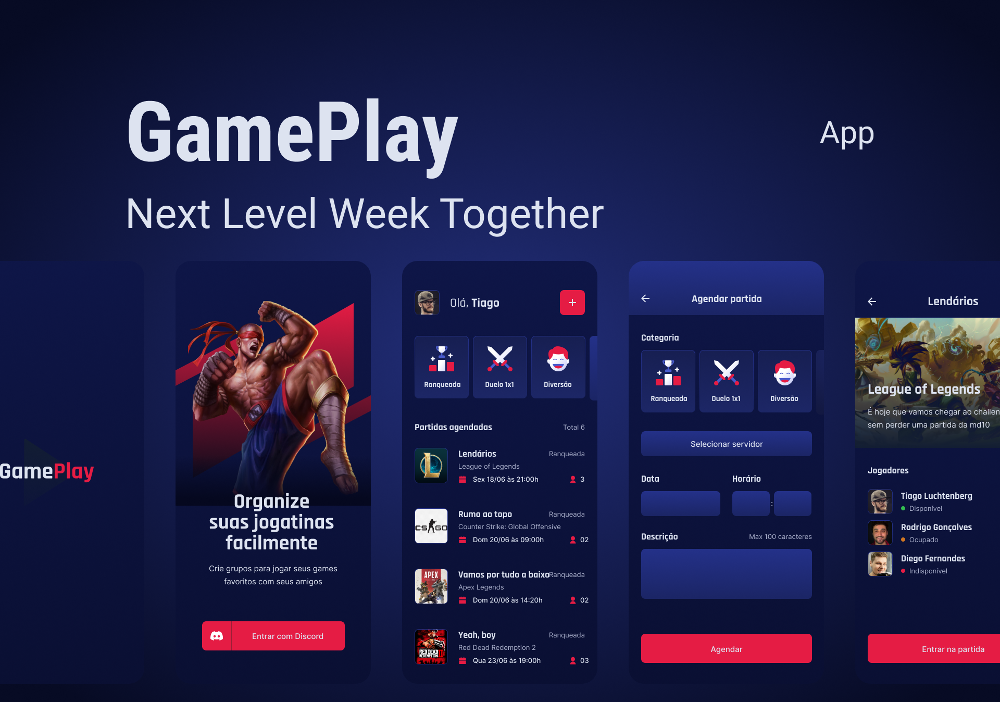

<h1 align="center">
  
</h1>

 

## ✨ Tecnologias

Esse projeto foi desenvolvido com as seguintes tecnologias:

- [React Native](https://reactnative.dev/)
- [TypeScript](https://www.typescriptlang.org/)
- [Expo](https://expo.dev/)
- [Axios](https://axios-http.com/ptbr/docs/intro)

## 💻 Projeto

Aplicativo para organizar suas jogatinas. Agende partidas, crie grupos e jogue com seus amigos.

## 🔖 Layout

Você pode visualizar o layout do projeto através [desse link](<https://www.figma.com/file/4X6M3wbp0ovcv6Cc5B71F6/GamePlay-(Community)>). É necessário ter conta no [Figma](http://figma.com/) para acessá-lo.

## 🚀 Como executar

- Clone o repositório
- Instale o `Expo`
- Rode a aplicação usando `expo start`

## 📄 Licença

Esse projeto está sob a licença MIT. Veja o arquivo [LICENSE](LICENSE.md) para mais detalhes.
